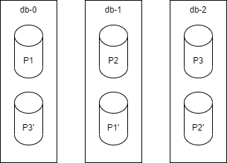

# js-code-test-arch

Proyecto de prueba de implementación de un ecosistema de microservicios para la implementación de CRUD sobre una entidad Usuario con el siguiente esquema:
``` 
{
    id: '13AE742', // an UUID string
    name: 'John Doe',
    email: 'john.doe@gmail.com',
    group: 3
}
```
La solución provee un servicio REST con las siguientes operaciones:
```
GET /api/user/{userID} 			(READs an user)
POST /api/user/ 			(CREATEs an user)
PUT /api/user/ 				(UPDATEs an user) 
DELETE /api/user/{userID} 		(DELETEs an user)
```

La operación de actualización será una actualización parcial.

## Arquitectura

La arquitectura contempla dos tipos de procesos:

 - gateway: es el proceso en el que reside el servicio REST.
 - db_process: n procesos que persisten los datos de usuario.


Los db_process usan rocksDB para la persistencia de los datos de usuarios. El sistema debe soportar la caída de unos de los db_process, para ellos, se elige el siguiente esquema (en principio, se diseña para tres db_process):



Cada proceso de base de datos contendrá su propia partición de base de datos, además de una réplica de la partición del proceso anterior. De este modo, si cae uno de los servidores, siempre tendremos una copia de respaldo en el servidor contiguo. Esto sigue siendo válido para n db_process:


La comunicación entre el gateway y los db_process se ha implementado mediante websockets, concretamente con la librearía socket.io. Esta decisión se basa en el hecho de que va a haber una comunicación constante entre todos los elementos. Mientras en el servicio REST que el gateway publica, lo esperado es tener que múltiples cliente que se conectan y desconectan esporádicamente para realizar las opearaciones CRUD, la comunicación entre los elementos de la solución va a ser continua, por lo que mediante los websockets vamos a conseguir ahorrar tiempos de conexión cada vez que se produce una de estas comunicaciones recurrentes (https://blog.feathersjs.com/http-vs-websockets-a-performance-comparison-da2533f13a77).

Se tiene en cuenta que al optar por los websockets, el escalado que podremos aplicar será un escalado vertical. En todo caso, si fuera necesario, se podría optar por un escalado horizontal de entrada en el REST del gateway, definiendo clusters con n db_process asociados a cada gateway.

### Operación de lectura
Se lanza la lectura sobre las réplicas de cada servidor (en caso de estar caído alguno de los db_process, se lanza sobre la partición primaria).


### Operaciones de actualización
Las operaciones de actualización se lanzan directamente sobre las particiones primarias de forma síncrona con la respuesta del servicio REST, mientras se lanza de forma asíncrona la actualización en la parición secundaria.

### Ejecución

 - Creación de las imágenes:
	 - gateway-process:
		 - En la carpeta gateway-process hay un Dockerfile con el que se puede generar la imagen docker:

			```docker build -t carlos_ferreira_ramilo/gateway-process . ```

		- En la carpeta db-process hay un Dockerfile con el que se puede generar la imagen docker:

			```docker build -t carlos_ferreira_ramilo/db-process .```

- Docker-compose:
	- Para lanzar la ejecución con Docker Compose, sobre la raíz del proyecto:

		``` docker-compose up -d ```
			
	- Para parar un cotenedor para probar la resistencia a fallo de un servidor:

		``` docker-compose stop db-1; sleep 60; docker-compose start db-1;```
				
	- Para parar la ejecución de Docker Compose:
		
		``` docker-compose down ``` 

En el docker-composer.yaml se pueden configurar los puertos, que por defecto son 3001 para el servidor rest y 3002 para los websockets. Asimismo, se podrían definir volúmenes para mapear el directorio de rocksdb en los db-process. Otras variables de entorno que se podrían definir:

 - gateway:
	 - NODE_ENV: entorno. Por defecto: development (de podría cambiar a production para cambiar trazas de log)
	 - LOG_DIR: ruta de los logs. Por defecto: logs
	 - REST_PORT: puerto del servidor REST. Por defecto: 3001
	 - SOCKET_PORT: puerto de websocket. Por defecto: 3002.
 - db_process:
	 - NODE_ENV: entorno. Por defecto: development (de podría cambiar a production para cambiar trazas de log)
	 - LOG_DIR: ruta de los logs. Por defecto: logs
	 - SOCKET_SERVER_URL: url del servidor websocket. Por defecto: ws://localhost:3002
	 - DB_INSTANCE_ID: identificador de la instancia. Por defecto: db-0. No debe haber dos db-process con el mismo nombre

### gateway-process


### db-process

        
## TODO:

 - Tests
 - Implementación de una operación de COUNT sobre los db_process
 - Implementación de una operación LIST con paginación sobre los db_process
 - Las actualizaciones en las particiones secundarias se podrían realizar entre los db_process en lugar de que sea el gateway el que las lance.
